# CvProject – Kişisel Portfolyo Web Uygulaması

Bu proje, **ASP.NET Core MVC** kullanılarak geliştirilmiş,  
**admin panelli ve veritabanı destekli** bir kişisel portfolyo web uygulamasıdır.

Amaç; gerçek bir projeye yakın mimari ile **MVC, EF Core ve Admin Panel** yapısını öğrenmek ve uygulamaktır.

---

## 🚀 Proje Amacı
- ASP.NET Core MVC mimarisini öğrenmek
- Entity Framework Core (Code First) ile CRUD işlemleri yapmak
- Admin Panel + Public (Vitrin) yapısını gerçek projeye yakın kurmak
- Katmanlı ve okunabilir bir proje yapısı oluşturmak

---

## 🛠 Kullanılan Teknolojiler
- ASP.NET Core MVC
- C#
- Entity Framework Core (Code First)
- MS SQL Server
- HTML, CSS
- Bootstrap (Public)
- TailwindCSS (Admin Panel)

---

## ✨ Özellikler

### 🔹 Public (Vitrin)
- Ana Sayfa
- Hakkımda
- Deneyimler
- Hizmetler
- Projeler
- İletişim Formu

### 🔹 Admin Panel
- Dashboard (istatistikler)
- Deneyim CRUD
- Proje CRUD
- Mesaj yönetimi
- İçerik güncelleme

---

## 📸 Ekran Görüntüleri

## 🌐 Public (Vitrin) – Anasayfa
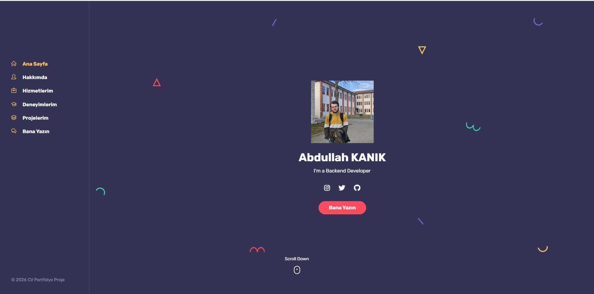
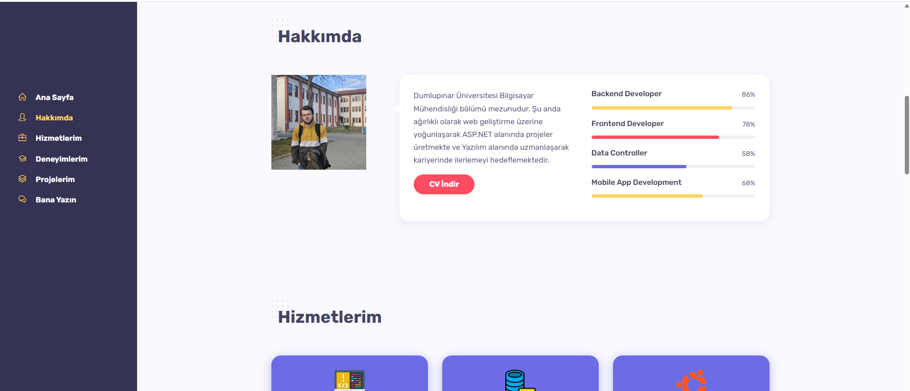
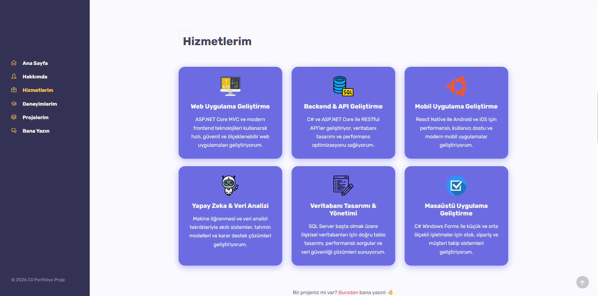
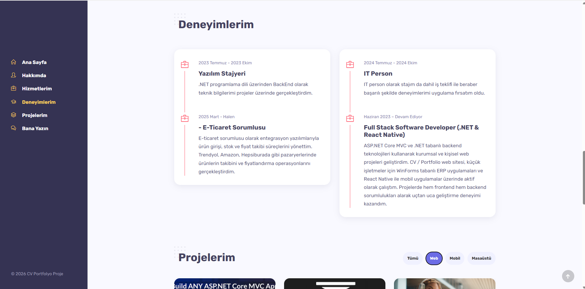
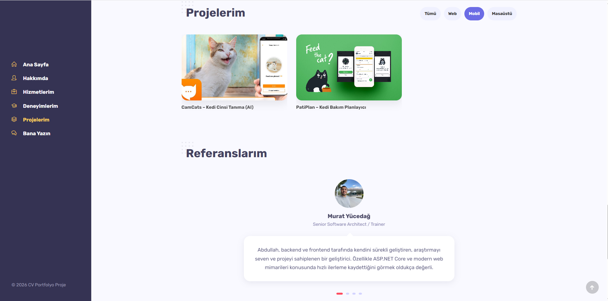
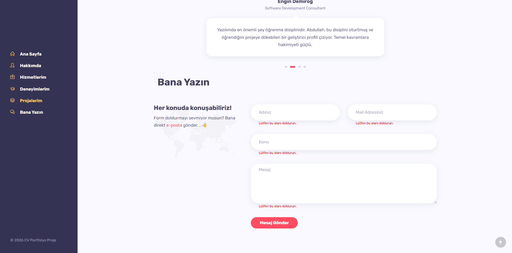

---

## 🧩 Admin Panel – Deneyimler
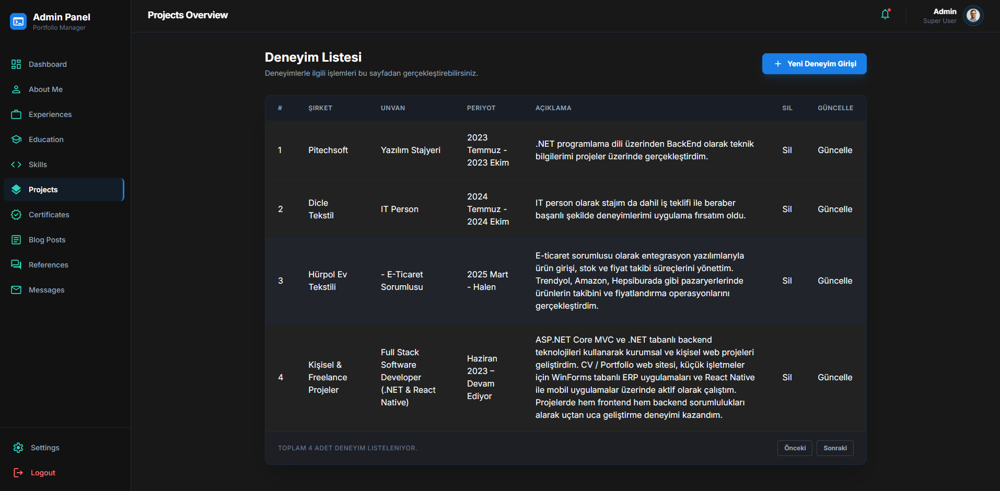

---

## 🛠 Admin Panel – Hizmetler
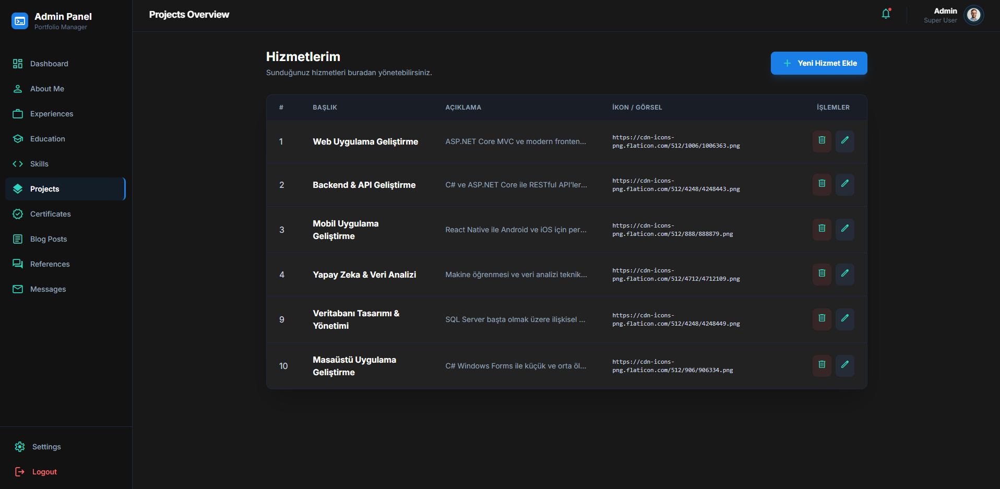

---

## 📊 Admin Panel – Mesaj İstatistikleri
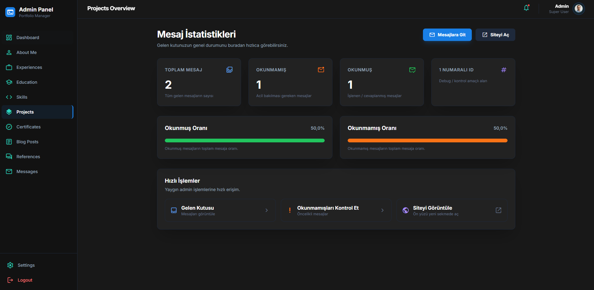

---

## 💬 Admin Panel – Mesaj Ekranı


---

## 📁 Admin Panel – Portfolyo
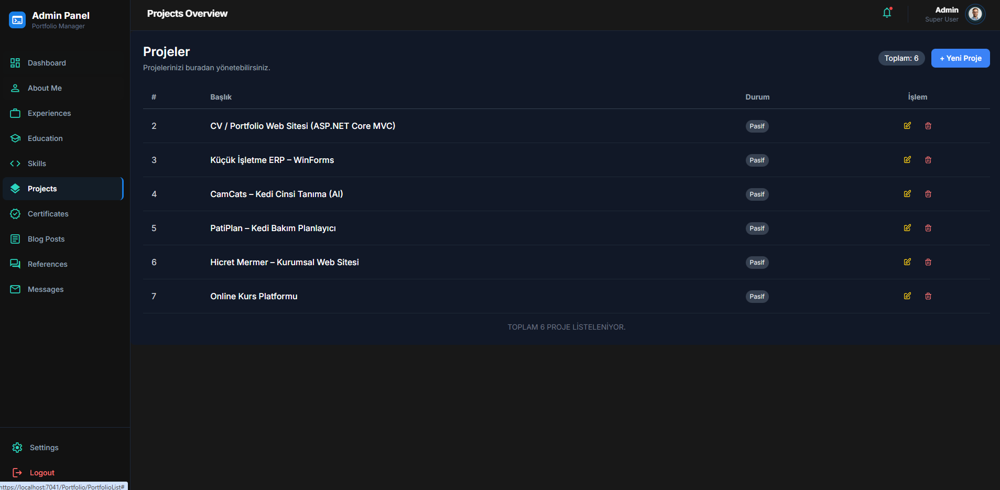

---

## ⭐ Admin Panel – Referanslar
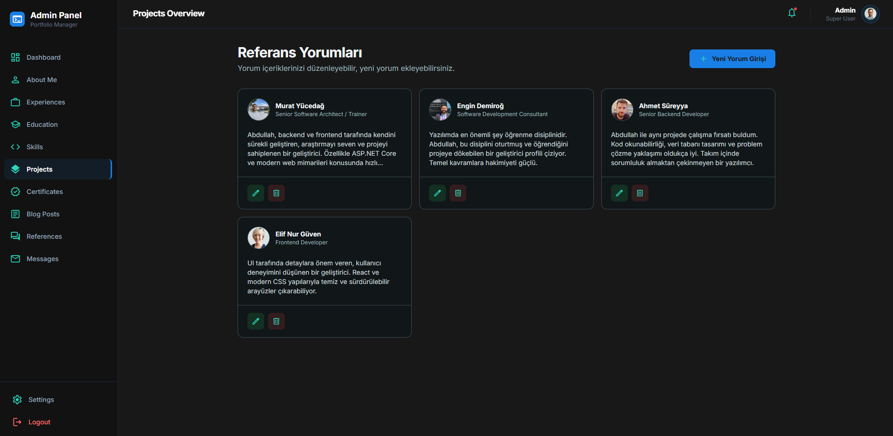

---

## ✏️ Admin Panel – Hakkımda Güncelleme
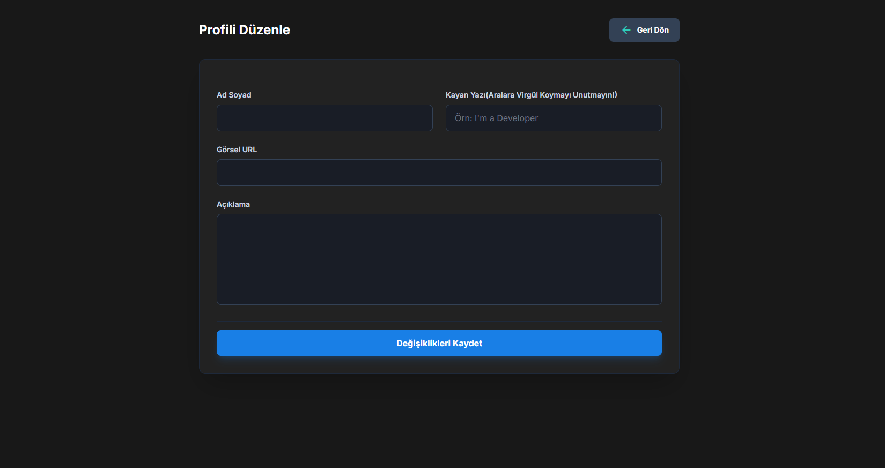

---

## 🧠 Admin Panel – Yetenekler
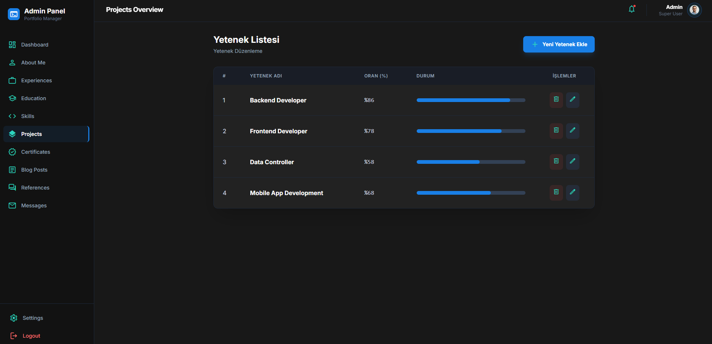


## ⚙️ Kurulum

1. Repoyu klonlayın:
```bash
git clone https://github.com/abdullahkanik/CvProject.git


