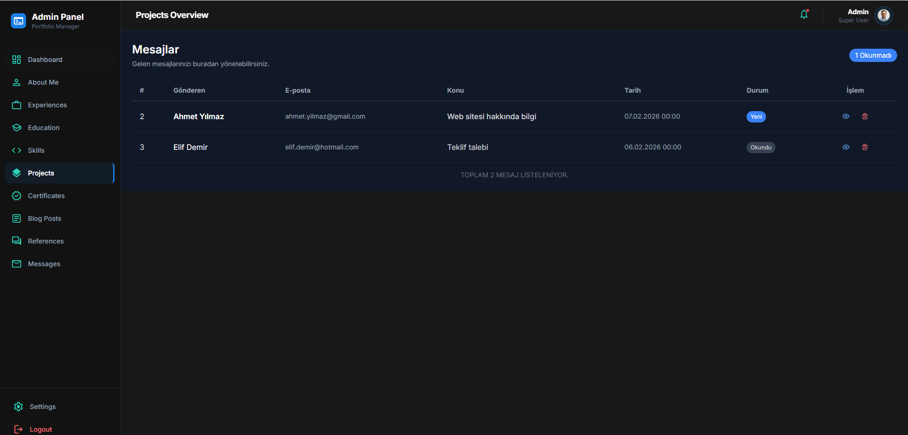

# 🚀 CvProject – Kişisel Portfolyo Web Uygulaması

Bu proje, **ASP.NET Core MVC** kullanılarak geliştirilmiş, **admin panelli ve veritabanı destekli** bir kişisel portfolyo web uygulamasıdır.  
Amaç, gerçek bir projeye yakın mimari ile **MVC, Entity Framework Core ve Admin Panel** yapısını öğrenmek ve uygulamaktır.

---

## 🎯 Proje Amacı

Bu projenin temel amacı;

- ASP.NET Core MVC mimarisini gerçek bir senaryo üzerinden öğrenmek  
- Entity Framework Core (Code First) yaklaşımı ile veritabanı işlemlerini yönetmek  
- Admin Panel + Public (Vitrin) yapısını gerçek projelere uygun şekilde kurgulamak  
- Katmanlı, okunabilir ve geliştirilebilir bir proje yapısı oluşturmaktır  

Proje boyunca hem **backend geliştirme mantığı** hem de **frontend entegrasyonu** bir arada ele alınmıştır.

---

## 🧩 Proje Hakkında

Bu proje, bir yazılım geliştiricinin veya profesyonelin;

- Kendisini tanıtabileceği  
- Yeteneklerini ve deneyimlerini sergileyebileceği  
- Tamamladığı projeleri görsel olarak sunabileceği  
- Ziyaretçilerden mesaj alabileceği  

**tamamen dinamik bir kişisel portfolyo web uygulamasıdır.**

Ziyaretçiler siteyi **Public (Vitrin)** alanından görüntülerken,  
site sahibi **Admin Panel** üzerinden tüm içerikleri **kod bilgisine ihtiyaç duymadan** yönetebilir.

---

## 🛠️ Kullanılan Teknolojiler ve Araçlar

- **Backend:** C#, ASP.NET Core MVC  
- **Veritabanı:** MS SQL Server  
- **ORM:** Entity Framework Core (Code First yaklaşımı)  
- **Frontend (Public):** HTML5, CSS3, Bootstrap, JavaScript (Hazır template entegrasyonu)  
- **Frontend (Admin):** Razor Views, Admin Template  
- **Mimari:** MVC (Model – View – Controller)  
- **Diğer:** ViewComponents, Migrations, Git & GitHub  

---

## 📦 Özellikler ve Modüller

Proje iki ana bölümden oluşmaktadır:

### 👤 Kullanıcı Arayüzü (Vitrin – Public)

- Ana Sayfa: Karşılama ekranı ve özet bilgiler  
- Hakkımda: Kişisel bilgiler ve biyografi  
- Yetenekler (Skills): Teknik yetkinliklerin yüzdelik gösterimi  
- Deneyimler: İş ve eğitim geçmişi (zaman çizelgesi)  
- Hizmetler: Sunulan hizmetlerin listelenmesi  
- Portfolyo: Tamamlanan projelerin görsellerle sergilenmesi  
- Referanslar (Testimonials): Müşteri veya iş arkadaşlarından yorumlar  
- İletişim: Ziyaretçilerin mesaj gönderebildiği iletişim formu  

---

### 🛠️ Yönetim Paneli (Admin Dashboard)

Admin panel üzerinden aşağıdaki modüller için **CRUD (Create, Read, Update, Delete)** işlemleri yapılabilmektedir:

- Dashboard (İstatistikler)  
- Hakkımda içeriği yönetimi  
- Deneyim ekleme / düzenleme  
- Yetenek (Skill) yönetimi  
- Hizmet yönetimi  
- Portfolyo projeleri yönetimi  
- Referans (Testimonial) yönetimi  
- Sosyal medya hesapları yönetimi  
- Gelen mesajları okuma ve yönetme  

---

## 📸 Ekran Görüntüleri

## 🌐 Public (Vitrin) – Anasayfa


---

## 🧩 Admin Panel – Deneyimler


---

## 🛠 Admin Panel – Hizmetler


---

## 📊 Admin Panel – Mesaj İstatistikleri


---

## 💬 Admin Panel – Mesaj Ekranı


---

## 📁 Admin Panel – Portfolyo


---

## ⭐ Admin Panel – Referanslar


---

## ✏️ Admin Panel – Hakkımda Güncelleme


---

## 🧠 Admin Panel – Yetenekler


Eğitim & Teşekkür
--------------------------
Bu proje, M&Y Yazılım Eğitim Akademi Danışmanlık tarafından sağlanan eğitim kapsamında geliştirilmiştir. 
Değerli katkıları ve öğretileri için Murat Yücedağ hocama teşekkür ederim.


## ⚙️ Kurulum

1. Repoyu klonlayın:
```bash
1- git clone https://github.com/abdullahkanik/CvProject.git
```
2- Projeyi Açın: ResumeProjectDemoNight.sln dosyasını Visual Studio ile açın.
3- Veritabanı Bağlantısını Yapılandırın: appsettings.json dosyasındaki ConnectionStrings bölümünü kendi SQL Server bilgilerinize göre güncelleyin.
4- Migrationları Uygulayın (Veritabanını Oluşturun): Visual Studio'da Package Manager Console'u açın ve şu komutu çalıştırın:
```
update-database
```
5- Projeyi Başlatın: Ctrl + F5 veya F5 tuşuna basarak projeyi tarayıcıda çalıştırın.


